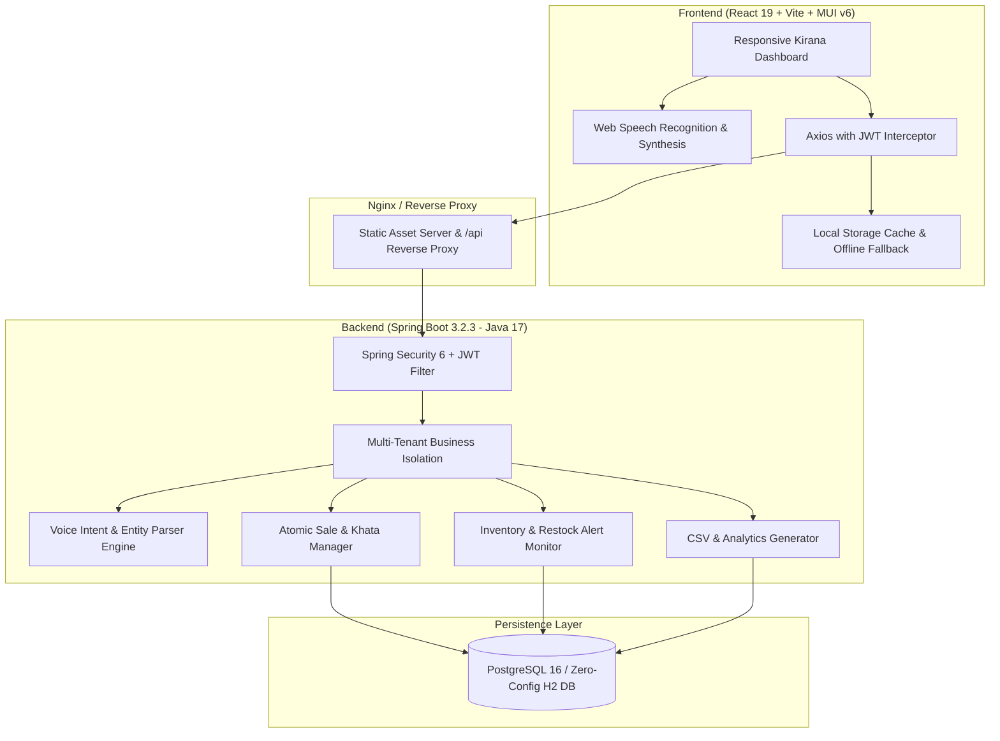

# Swaranidhi (స్వరనిధి / स्वरनिधि)
> **"Speak. Manage. Grow."** — AI-Powered Voice-Based Inventory & Khata Management System for Small Businesses and Kirana Stores.

[](https://spring.io/projects/spring-boot)
[](https://react.dev/)
[](https://www.postgresql.org/)
[](https://mui.com/)
[](LICENSE)

---

## 📖 Executive Summary

**Swaranidhi** is a purpose-built, intelligent retail inventory and Udhaar/Khata management solution designed specifically for Indian micro-retailers, Kirana shopkeepers, and local merchants. By marrying modern progressive web technologies with multilingual voice processing (English, Telugu, Hindi, Romanized Telugu, and Hinglish), Swaranidhi enables shopkeepers to manage inventory, track daily sales, record credit customer payments, and generate printable receipts simply by speaking.

---

## 🏛️ System Architecture



---

## ✨ Key Capabilities & Workflows

### 1. Multilingual Voice Assistant (English, Telugu, Hindi, Hinglish)
- **Natural Language Parsing**: Supports queries like `"20 packets Aashirvaad Atta add cheyyi"`, `"Add 20 packets Maggi"`, `"आज की sales कितनी है?"`, and `"Ramesh ki 500 rupay udhaar likho"`.
- **Speech Synthesis (TTS)**: Verbal confirmations in the shopkeeper's preferred regional language.
- **Safety Dialogs**: Non-destructive queries (e.g. stock lookups, sales reports) execute instantly; state-mutating actions (adding stock, khata debt) present a high-clarity voice confirmation card.

### 2. Digital Khata & Udhaar Ledger
- **Customer Profiles**: Record customer balances, credit limits, contact numbers, and transaction history.
- **Payment Recording**: 1-click modal to accept cash, UPI, or bank transfer payments and automatically decrease outstanding Udhaar balance.
- **Audit Logs**: Immutable ledger tracking each credit sale and settlement.

### 3. Point-of-Sale (POS) & Printable Invoices
- **Fast Billing**: Dynamic product dropdown with live stock availability, quantity validation, and instant price tallying.
- **Thermal / A4 Printable Receipts**: Instant formatted receipts with shop header, GSTIN, itemized break-up, payment mode, and customer balance (`window.print()`).

### 4. Smart Restocking & Alerts
- Real-time detection of low-stock and out-of-stock items against custom minimum thresholds.
- Dedicated store notifications hub with quick-action supplier reordering.

### 5. Multi-Tenant Business Isolation
- Strictly isolated database queries using `business_id` extracted from cryptographically verified JWT tokens.

---

## 🎙️ Supported Voice Commands

| Intent | Language | Example Spoken Phrase | Action Taken |
|---|---|---|---|
| **ADD_STOCK** | Telugu / English | *"20 packets Aashirvaad Atta add cheyyi"* | Increases Aashirvaad Atta stock by 20 |
| **ADD_STOCK** | Hindi / English | *"Doodh ke 15 packet add karo"* | Adds 15 packets Milk to stock |
| **ADD_STOCK** | English | *"Add 50 kg sugar"* | Adds 50 kg Sugar to stock |
| **RECORD_SALE** | Telugu | *"Ramesh ki rendu packets Maggi ammanu"* | Records sale of 2 Maggi packets to Ramesh |
| **RECORD_SALE** | Hindi | *"Suresh ko 2 kilo chawal becha"* | Records sale of 2 kg Rice to Suresh |
| **KHATA_CREDIT** | Mixed | *"Ramesh ki 500 rupay udhaar likho"* | Adds ₹500 to Ramesh's Khata balance |
| **CHECK_STOCK** | English / Telugu | *"Maggi stock entha undi?"* / *"Check Maggi stock"* | Speaks out current stock quantity |
| **SALES_REPORT** | Hindi | *"आज की sales कितनी है?"* | Reports today's total revenue & count |
| **LOW_STOCK** | English | *"Show low stock items"* | Navigates to filtered low-stock items |

---

## 🚀 Quick Start (Local Development)

### Prerequisites
- **Java 17+** (Eclipse Temurin or OpenJDK)
- **Maven 3.8+**
- **Node.js 18+** & `npm`

### 1. Clone Repository
```bash
git clone https://github.com/swaranidhi/swaranidhi.git
cd Swaranidhi
```

### 2. Start Backend (Spring Boot)
The backend is pre-configured with embedded PostgreSQL-compatible storage for immediate zero-config operation:
```bash
cd backend
mvn spring-boot:run
```
*Backend runs on `http://localhost:8080`. Seed data is loaded automatically.*

### 3. Start Frontend (React + Vite)
In another terminal:
```bash
npm install
npm run dev
```
*Frontend runs on `http://localhost:5173`.*

---

## 🐳 Docker Deployment

To launch the full production stack (PostgreSQL 16 + Spring Boot Backend + Nginx React Frontend):

```bash
# Copy template environment variables
cp .env.example .env

# Build and start all services
docker-compose up -d --build
```

- **Frontend**: `http://localhost`
- **Backend API**: `http://localhost:8080/api`
- **PostgreSQL**: `localhost:5432`

---

## 🔑 Default Demo Credentials

| Role | Email | Password | Shop Name |
|---|---|---|---|
| **Store Owner** | `owner@kirana.com` | `password123` | Swaranidhi Kirana & General Store |

*(A handy "Demo Credentials" auto-fill button is available directly on the login screen for instant evaluation).*

---

## 🛡️ Security & Reliability
- **BCrypt Encryption**: Passwords salted and hashed with BCrypt.
- **JWT Authentication**: Stateless, HMAC-SHA384 signed tokens with 24-hour expiration.
- **Atomic Transactions**: All inventory adjustments and khata credits use `@Transactional` ensuring zero partial records on network or hardware failure.
- **Resilient Offline Fallback**: Client falls back to cached local storage if the internet drops and synchronizes when reconnected.

---

## 📄 License
This project is open-source and licensed under the [MIT License](LICENSE).
